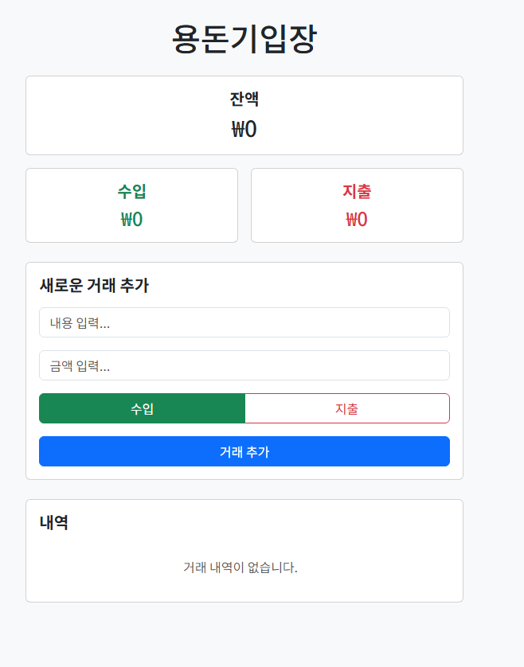

# 용돈기입장 (Money Tracker)

## 개요

용돈기입장은 사용자가 수입과 지출을 기록하고 잔액을 관리할 수 있는 웹 애플리케이션입니다.

모든 데이터는 브라우저의 로컬 스토리지에 저장되어 페이지 새로고침 후에도 데이터가 유지됩니다.

## 주요 기능

- 💰 잔액 관리
  - 현재 잔액 표시
  - 수입/지출 합계 표시
- 📝 거래 기록
  - 거래 내역 설명 입력
  - 금액 입력
  - 수입/지출 구분
- 📊 거래 내역
  - 거래 목록 표시
  - 수입(녹색 '+')/지출(빨간색 '-') 구분
  - 거래 삭제 기능 (확인 모달 포함)
- 💾 데이터 저장
  - LocalStorage를 활용한 데이터 영구 저장

## 기술 스택

- React
- TypeScript
- TailwindCSS
- LocalStorage API

## 설치 및 실행

bash
# 저장소 클론
git clone https://github.com/your-username/money-tracker.git

# 프로젝트 디렉토리 이동
cd money-tracker

# 의존성 설치
npm install

# 개발 서버 실행
npm run dev

# 프로덕션 빌드
npm run build

## 프로젝트 구조

money-tracker/
├── src/
│   ├── components/     # 재사용 가능한 컴포넌트
│   ├── hooks/         # 커스텀 훅
│   ├── types/         # TypeScript 타입 정의
│   ├── utils/         # 유틸리티 함수
│   └── App.tsx        # 메인 애플리케이션
├── public/            # 정적 파일
└── package.json       # 프로젝트 설정

## 데이터 구조

typescript
interface Transaction {
  id: number;
  description: string;
  amount: number;
  type: "income" | "expense";
  date: string;
  category?: string;
}

## 사이트 바로가기

[사이트 바로가기](https://alex8396.github.io/money-tracker/)
